# CjS

CjS (Custom JavaScript) är ett verktyg som används för att med hjälp av skräddarsydda anpassningar effektivisera sitt dagliga arbete i OP5, Servicedesk Plus, Qradar, Cisco AMP och Qualys.

CjS består främst av sex Javascriptfiler: op5.js, sdp.js, qradar.js, amp.js, qualys.js och basskript.js. De alla utgör dock projektet CjS och har därför ett gemensamt versionsnummer.
Nuvarande version är 5.3.0
 

## Systembeskrivning

CjS körs med hjälp av webbläsarpluginet [Custom JavaScript for Websites 2](https://microsoftedge.microsoft.com/addons/detail/custom-javascript-for-web/koccodmekleicmjpnelamemnhkpbkibc), som är godkänt för användning i Microsoft Edge och Google Chrome inom Region Kalmar Län. Med hjälp av pluginet körs skriptet basskript.js när man är på en sida som ligger på regionens domän. Detta skript kontrollerar om man befinner sig på någon av adresserna för OP5, SDP, Qradar, Cisco AMP eller Qualys, och kör i så fall ett specifikt skript för den sidan. Skripten ligger på en webbserver på servern serverX, vilket gör att de är tillgängliga från var som helst på regionens nätverk. Detta möjliggör också att skripten kan uppdateras kontinuerligt utan någon interaktion från användaren.
 

## Installation

CjS är för närvarande tillgängligt i webbläsarna Microsoft Edge och Google Chrome.

Installera webbläsarpluginet [Custom JavaScript for Websites 2](https://microsoftedge.microsoft.com/addons/detail/custom-javascript-for-web/koccodmekleicmjpnelamemnhkpbkibc) ([Länk för Chrome här](https://chromewebstore.google.com/detail/custom-javascript-for-web/ddbjnfjiigjmcpcpkmhogomapikjbjdk?hl=sv&utm_source=ext_sidebar)). Öppna det genom att klicka på ikonen.

Du får nu upp rutan nedan. Välj New Regexp.

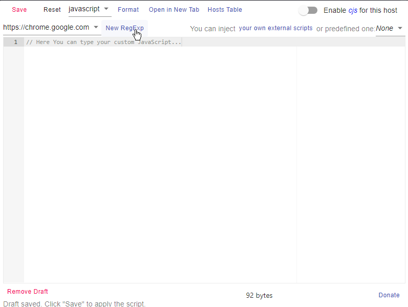

Du får nu upp en ruta där du fyller i det reguljära uttrycket `/*.ltkalmar.se*/`. Genom att göra detta anger du att basskriptet ska köras om man är på en sida på ltkalmar.se. Välj därefter Add.

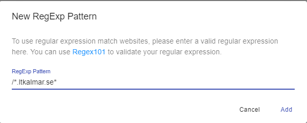

Klicka på den runda knappen i övre högra hörnet för att aktivera regexet. Klicka därefter på "your own external scripts". 

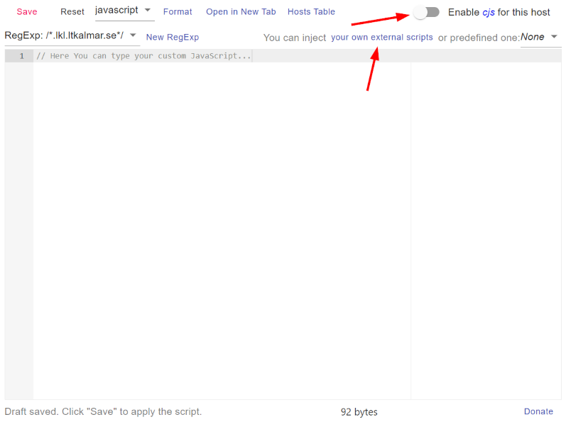

Du får nu upp en ruta där du ska ta bort all text (inklusive tomma rader) och lägga in länken https://serverx.lkl.ltkalmar.se/cjs/basskript.js.

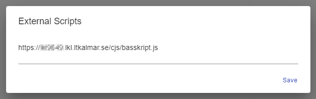

Klicka därefter på Save och därefter igen på Save på den tidigare rutan.

CjS är nu färdigkonfigurerat och du kan börja använda de olika funktionerna. 

## Användning

I CjS finns en mängd olika funktioner som hjälper dig i det dagliga arbetet.

### OP5

Inne på checksidan i OP5 finns ett antal knappar, varav de största autoförminskar sig om man förminskar webbläsarfönstret.

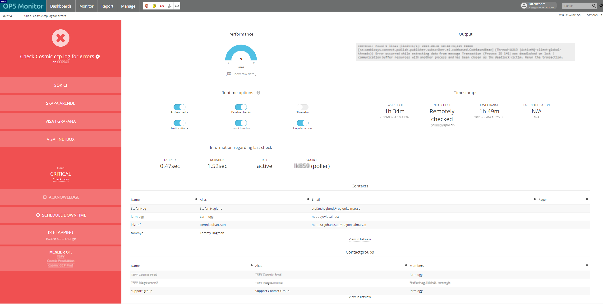

Knapparna som finns är:

* #### Sök CI

   Sök CI-knappen öppnar CMDB i en ny flik där den automatiskt fyller i aktuellt hostnamn i sökfältet. Därefter får man manuellt välja rätt host.

* #### Skapa ärende

   Skapa ärende samlar in den information som behövs för ett ärende, och öppnar därefter ett nytt ärende med Larmhantering-mallen i en ny flik. Inne i ärendet så fylls beställare i som Operations Center automatiskt, därefter associeras aktuell host som tillgång (förutsatt att den hittas). Om en tillgång kunde associeras så görs ett API-anrop mot CMDB som kollar vilket system som körs på hosten och associerar även detta. Om ett system har hittats kollas även via API-anrop vilket team som supportar systemet, varpå system och team skrivs ut med röd text ovanför Grupplistan. Slutligen så fylls ärendeinformationen i automatiskt i ärendetexten. Det enda som användaren behöver göra är alltså att tilldela ärendet till en grupp, ge en titel och kontrollera att alla uppgifter stämmer. I OP5-fliken öppnas ackningssidan, så att man med hjälp av [Kopiera ärendelänk-knappen](#kopiera-ärendelänk) snabbt kan klistra in en länk till ärendet som kommentar till ackningen.

* #### Autogenerera ärende

   Autogenerera ärende-knappen samlar in nödvändig information från OP5 och skapar därefter ett ärende via SDP-API:et. För att det ska funka förutsätter det att det i CMDB finns ett systen som körs på hosten och en supportgrupp till systemet. Om detta inte finns får man en varning, och inget ärende skapas. Innan ärendet skapas frågas man om prioritet på ärendet. I OP5 läggs också en ackning med länk till ärendet följt av vem som lagt ärendet.

* #### Visa i Grafana

   Visa i Grafana-knappen öppnar aktuell host i Grafana. Dashboarden som öppnas är en översiktsdashboard som visar åtkomststatus, packet loss, CPU-användning, minnesanvändning och diskanvändning. Är vald enhet en nätverksenhet så öppnas en dashboard för nätverksutrustning som visar åtkomststatus, packet loss över tid, trafikmängd in och ut samt errors in och ut.

* #### Visa i Netbox

   Visa i Netbox-knappen söker på hosten i Netbox.

* #### Visa i Changelog

   Visa i Changelog-knappen återfinns i det övre högra hörnet av sidan, bredvid Options. Knappen söker efter hosten i changelogen, och visar på så sätt snabbt alla ändringar som gjorts på den.

* #### Visa i Eventlog

   Visa i Eventlog-knappen återfinns bredvid Visa i Changelog-knappen och öppnar aktuell host i Eventloggen.

*  #### Klickbara länkar i kommentarer

   Som standard är länkar som läggs i kommentarerna inte klickbara. Detta åtgärdas med hjälp av denna funktion.

 

På övriga ställen i OP5 finns nedanstående funktioner:

*  #### Inga larm

   Om man är i listvyn och det inte finns något i listan kommer ett fyrverkeri och texten "INGA LARM" visas.

* #### Kopiera larminfo

   Kopiera larminfo-knappen är en blå ikon med två papper på som finns på varje check i listvyn för services, under Actions-kolumnen.

   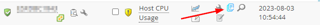

   Knappen kopierar samma info som infogas i ärendet när man använder Skapa ärende-knappen. Detta är användbart om man ska skapa ett ärende för flera larm. Då kan man skapa ett ärende med Skapa ärende-knappen på det första larmet, och därefter använda Kopiera larminfo-knappen för att klistra in övrig larminfo i ärendet. Knappen blir till en grön bock efter att man klickat på den, vilket dock försvinner efter max 30 sekunder då listan uppdateras.

* #### Sök CI från listvyn

   Sök CI-knappen i listvyn återfinns bredvid Kopiera larminfo-knappen och består av ett förstoringsglas. Den är tillgänlig både i listor med hostar och servicar.

   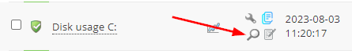

   Knappen söker i listvyn på samma sätt som Sök CI-knappen inne på en check.

* #### Skapa ärende från listvyn

   Skapa ärende-knappen i listvyn återfinns bredvid Sök CI-knappen och består av ett papper med en penna. Den är bara tillgänglig i listor med servicar.

   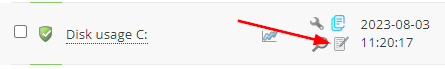

   Knappen skapar ett nytt ärende på samma sätt som Skapa ärende-knappen inne på en check, och går därefter till ackningssidan.

* #### Checka alla

   Checka alla-knappen är tillgänlig i listvyn och återfinns överst i listan.

   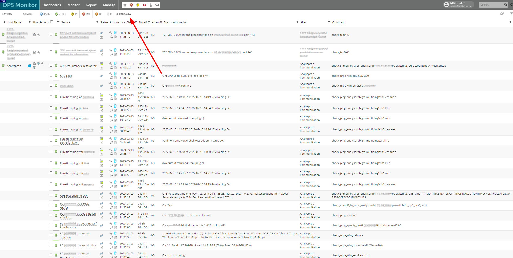

   Checka alla knappen gör en Check now på alla checkar i listan.

* #### Automatisk Done-klickning

   Funktionen automatisk Done-klickning klickar automatiskt på Done-knappen efter att man exempelvis gjort Check now på en check. Sidan med Done-knappen ger ingen användbar information och stängs med hjälp av funktionen direkt ner.

* #### Automatisk öppning av ändringar

   När man gjort ändringar och klickar på Save för att granska sina ändringar, så öppnar funktionen automatiskt alla ändringar för att visa all information. Detta är särskilt användbart då man gör många ändringar på en gång och vill se att inget oönskat kommer med.

 

### Servicedesk Plus

I ärendehanteringssystemet Servicedesk Plus (SDP) finns två funktioner som effektiviserar arbetet.

* #### Kopiera ärendelänk

   Kopiera ärendelänk-knappen finns på ärenden, längst till höger på listen med knappar högst upp i ärendet.

   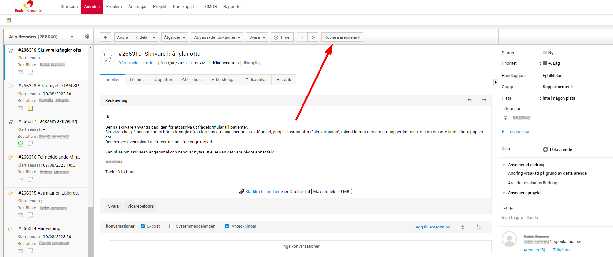

   Knappen kopierar länken till aktuellt ärende och lägger dessutom till två snedstreck och ens eget namn efter. Knappen är avsedd att användas tillsammans med [Skapa ärende-knappen](#skapa-ärende) för att klistra in en ärendelänk som kommentar till en ackning, men kan även användas i andra sammanhang.

* #### Visa i OP5

   Visa i OP5-knappen finns inne på sidan för ett CI i CMDB. Knappen finns på listen längst upp på sidan.

   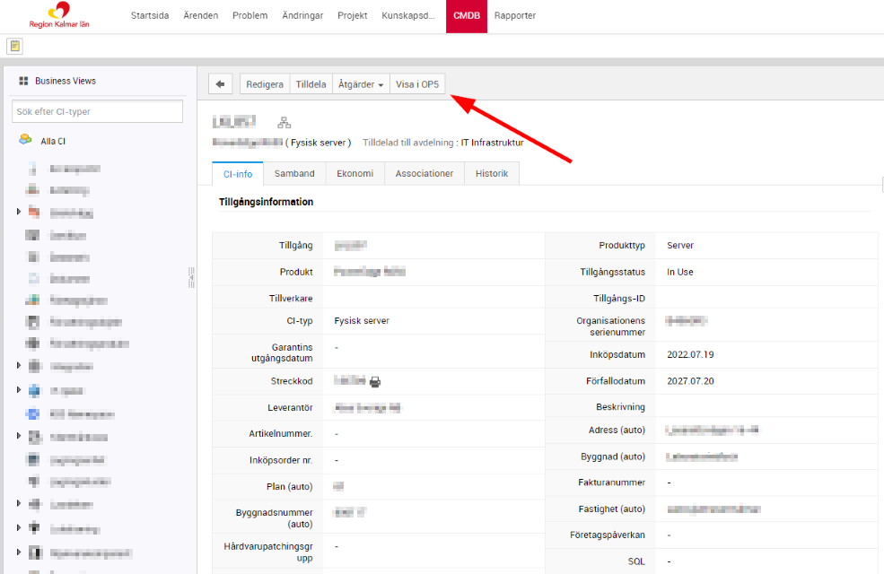

   Knappen tar en till OP5-sidan för aktuellt CI.

 

### Qradar

För närvarande finns det tre funktioner i Qradar, vilket är två knappar som finns uppe till höger när man är inne på ett offense.

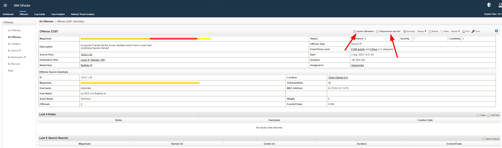

* #### Kopiera offenselänk

   Kopiera offenselänk-knappen kopierar länken till offenset man är inne på. Eftersom ett offense inte öppnas i en ny sida så leder länken i webbläsarfönstret inte till det aktuella offenset, utan till listan med alla offense. Med hjälp av knappen är det dock möjligt att snabbt och enkelt kopiera länken till det specifika offenset.

* #### Skapa ärende med länk

   Skapa ärende med länk-knappen öppnar ett nytt ärende i SDP med Larmhantering som mall. Den kopierar också offenselänken på samma sätt som Kopiera offenselänk-knappen, så att man direkt kan klistra in en länk i ärendet. Den öppnar även offensets sida för att lägga till en anteckning i en ny flik, så att man kan lägga till en anteckning med till exempel ärendelänk.

*  #### Sök CI

   När man är inne i Qradar söks det automatiskt efter sådant som ser ut som hostnamn enligt Regionens namnstandard. Om några hostnamn hittas läggs det till en Sök CI-knapp efter dem, som söker på hosten i SDP.

*  ### Autogenerera ärende

   Autogenerera ärende-knappen samlar in information om offenset och skapar därefter ett SDP-ärende och går till det. Det skapas dessutom automatiskt en kommentar i Qradar med länk till ärendet.

 

### Cisco AMP

I Cisco AMP finns det två knappar på varje dator som ligger i Inboxen.

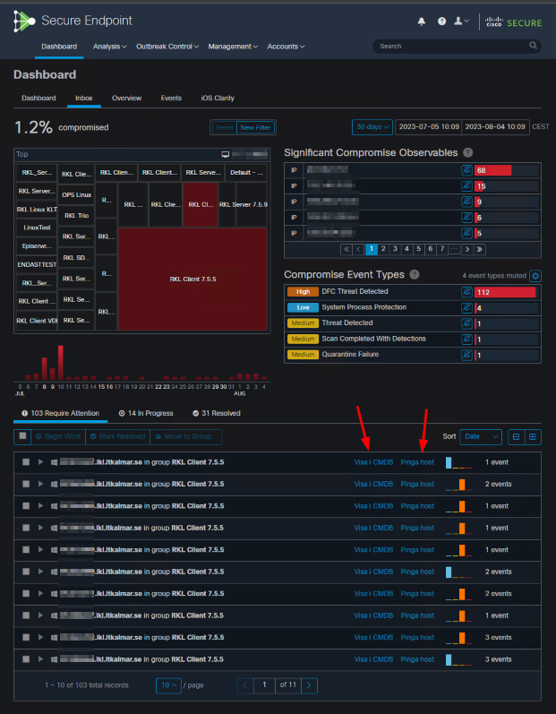

* #### Sök CI

   Sök CI-knappen söker på den aktuella hosten i SDP.

* #### Pinga host

   Pinga host-knappen pingar den aktuella hosten. Detta kan vara användbart till exempel om man ska starta en skanning och vill se om datorn är online för att veta om man kan förvänta sig ett resultat snart.

   Pinga host-knappen använder sig av Qradar-serverns pingfunktion. Detta innebär att man kan komma att få upp en inloggningsruta för Qradar när man använder knappen. Det innebär också att det inte är möjligt att använda knappen på icke-trådat nät.

 

### Qualys

I Qualys finns det två knappar, Sök i CMDB och Sök i Netbox.

* #### Sök CI
   
   Sök CI-knappen söker på den aktuella hosten i SDP. Knappen sätts in överallt där det finns ett hostnamn.

* #### Sök i Netbox

   Sök i Netbox-knappen söker på den aktuella IP-adressen i Netbox. Knappen sätts in överallt där det finns en IP-adress.

 

## Loggning

När du använder funktioner i CjS så loggas detta automatiskt till Log4CjS, ett API på servern serverX. Loggarna läggs därefter i en databas, där man kan se statistik över hur funktionerna används. Datan som samlas in är tid, vilken funktion som använts, eventuellt objekt som hanterats (t.ex. ett CI), vilken hemsida man befinner sig på, och vem som använt funktionen. Mer info om Log4CjS finns [här.](https://gitlab.lkl.ltkalmar.se/oc/log4cjs)

## Support

För buggrapporter och förbättringsförslag, [öppna ett issue i Gitlab.](https://gitlab.lkl.ltkalmar.se/oc/cjs/-/issues "Issue") Märk issuet med någon av labelarna "Bugg" eller "Förbättringsförslag".